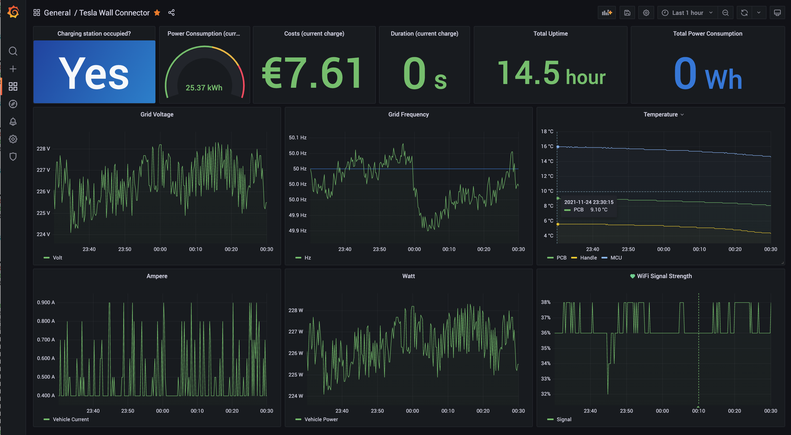

# Tesla Wall Connector Dashboard

This project builds upon [fynn.sh's TeslaWallConnector exporter](https://github.com/fynnsh/teslawallconnector-exporter), which itself is based on [Marc Sowen's work](https://github.com/marcsowen/teslawallconnector-exporter).



The aim was to create a simple setup for everybody to get started monitoring his / her own Tesla Gen3 Wall Connector, i.e. setting up the Python proxy server "connector" to translate Tesla's API data into a format consumable by [Prometheus](https://prometheus.io/), setting up Prometheus and finally [Grafana](https://grafana.com/) itself and starting with a pre-configured Dashboard.

Right now the configuration is still spread across different files:

* `CONNECTOR_ROOT` in `build-and-run.sh`: point to a volume that should act as storage for Prometheus and Grafana
* `ip_address` in `connector/start.py`: set this to the IP address of your Tesla Wall Connector in your LAN
* "Costs (current charge)" `targets.expr` in `grafana/dashboards/tesla-wall-connector.json`: Change the multiplier (default "0.3" meaning 0.30 EUR) according to your current tariff

Once everything is configured, fire up

```
$ ./build-and-run.sh
```

The services should then be available at

* Connector: http://localhost:9225
* Prometheus: http://localhost:9090
* Grafana: http://localhost:3000

The initial login for Grafana is "admin" / "admin" (without quotes). After you entered these you're prompted to set up new credentials. The preconfigured Dashboard should afterwards be reachable via http://localhost:3000/d/6gOK9dzga/tesla-wall-connector?orgId=1.

This setup is, as of now, only tested on a Synology NAS. You need their [Docker package](https://www.synology.com/en-global/dsm/packages/Docker) and a root ssh login to set this project up.

Have fun
- Thomas
